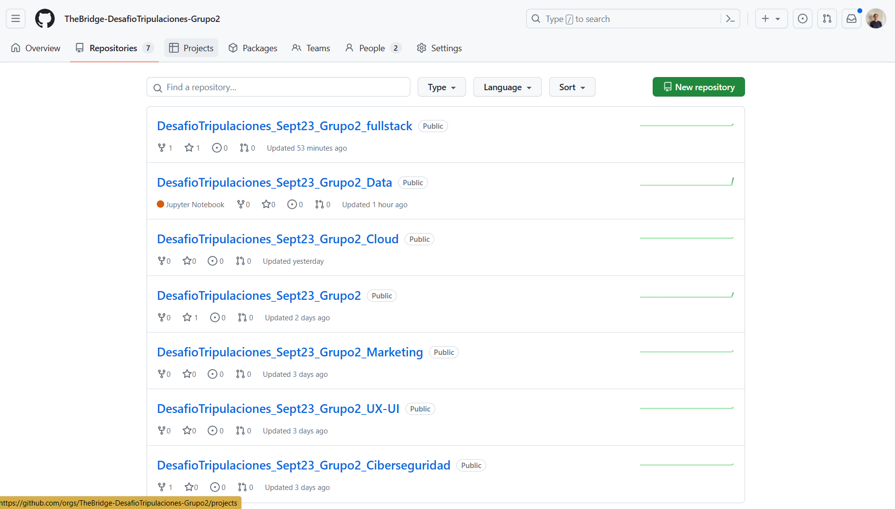
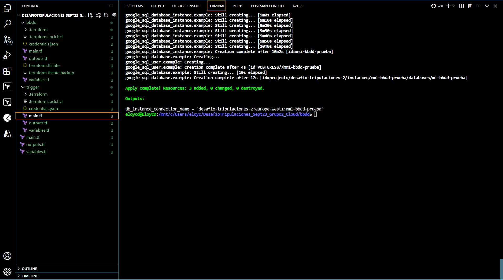
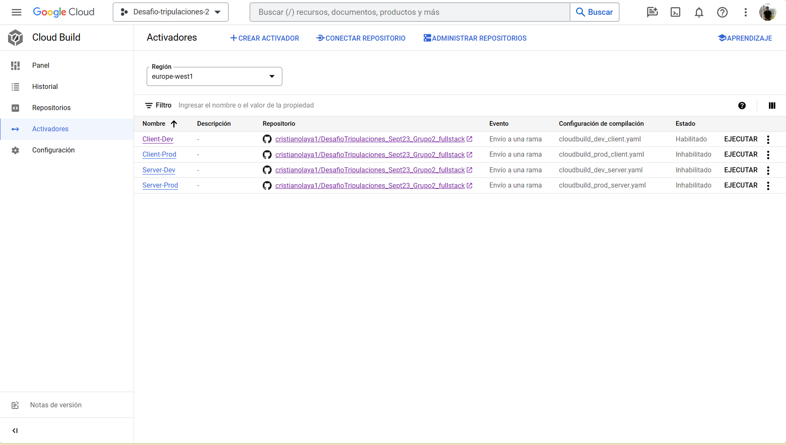
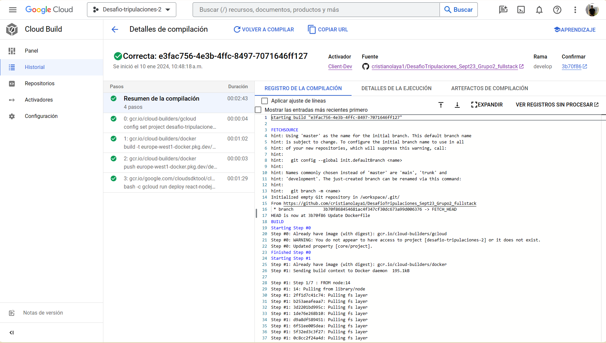

# DesafioTripulaciones-Grupo2-Cloud
### Integrantes: Eloy Campos y Cristian Olaya

# Índice:

<ol>
  <li><a href="#objetivos"> Objetivos </a></li>
  <li><a href="#permisos"> Niveles de acceso (permisos) </a></li>
  <li><a href="#iac">Infraestructura como codigo (IaC) </a></li>
  <li><a href="#cicd"> CI/CD </a></li>
  <li><a href="#monitorizacion"> Monitorización y gestion de logs </a></li>
</ol>

# Objetivos

 Seleccionar la cuenta de Cloud asociada al grupo del proyecto. Buscar la forma de conseguir gratuidad para el tiempo que 
dure el desafío de tripulaciones.

● Establecer los miembros del equipo que tendrán acceso al proyecto. Crear niveles de acceso y edición de recursos. 

● Despliegue de infraestructura en la nube: Diseño de una infraestructura en la nube utilizando servicios de AWS, Azure o GCP. 
La arquitectura que monten debe estar debidamente pintada en las herramientas correspondientes. 

● Automatización y gestión de la infraestructura: Se deberá automatizar el aprovisionamiento y la gestión de infraestructura en 
la nube. Esto implica definir y desplegar la infraestructura mediante código (Infrastructure as Code) y utilizar técnicas de 
automatización para su configuración y actualización.

● Implementación de pipelines de CI/CD: Los alumnos deben establecer un flujo de integración continua y entrega continua 
(CI/CD). Deben construir una aplicación que permita la construcción y despliegue automatizado de la aplicación o servicios 
desarrollados. 
○ Definir la arquitectura de CI en función del tipo y lenguaje de la aplicación a desarrollar
○ Definir la arquitectura de CD en función del objetivo (Solo Dev, Dev y Prod)

● Monitorización y gestión de logs: Implementar una solución de monitorización, donde los desarrolladores puedan comprobar 
en todo momento el estado de su solución desplegada. 

● Seguridad y cumplimiento: Los alumnos deben asegurar la infraestructura y la aplicación mediante buenas prácticas de 
seguridad para que no se pueda utilizar de forma inadecuada por elementos ajenos a la organización ni de forma indebida por 
elementos de la organización. 

Desde Cloud hemos creado una organización en GitHub con diferentes repositorios para cada vertical con el fin de ir canalizando y automatizando el trabajo de cada grupo.

# Niveles de acceso (gestión de permisos)

Permisos

# Infraestructura como código con TERRAFORM

Terraform es una herramienta de código abierto desarrollada por HashiCorp que se utiliza para automatizar la infraestructura y la gestión de la configuración. Permite a los usuarios definir y provisionar de manera declarativa la infraestructura y los recursos en la nube mediante la creación de archivos de configuración llamados "archivos de configuración de Terraform". Estos archivos describen los recursos deseados y sus relaciones, y Terraform se encarga de crear, modificar o destruir esos recursos de manera eficiente y coherente. La herramienta es compatible con varios proveedores de servicios en la nube, como AWS, Azure, Google Cloud, entre otros, lo que facilita la gestión de la infraestructura en entornos multicloud.

En el equipo de Cloud, hemos decidido utilizar Google Cloud Platform (GCP) como proveedor de nube para levantar nuestra aplicación, y como consecuencia Terraform es la herramienta que mejor se adapta a las necesidades de automatización en GCP.

El primer paso que dimos desde Cloud en Terraform fue crear la infraestructura como código para automatizar la base de datos, lo cual fue existosa.

# Pipeline de despliegue en GCP

Los activadores en el contexto de una pipeline de despliegue son eventos o condiciones que inician automáticamente el proceso de despliegue. En este caso, lo hemos dividido en dos pipelines, una para  desarrollo y otra para producción. Estos activadores aseguran que el despliegue se realice en respuesta a cambios.

El activador esta asociado a un repositorio como GitHub, cuando se produce un cambio, el activador se pone en marcha, iniciando el proceso de construcción a través de Cloud Build.

Los principales eventos a tener en cuenta en el desarrollo de una pipeline son:

- Definir el Flujo de Trabajo (Workflow)
- Integración Continua (CI)
- Automatización de Pruebas
- Despliegue Continuo (CD)
- Monitoreo y Retroalimentación
- Gestión de Configuración
- Seguridad
- Pruebas en Producción

Cuando fullstack realiza un commit a la rama de dessarrollo, el activador se pone en marcha, ejecutando la cloudbuild, tal y como se muestra en la imagen inferior.

